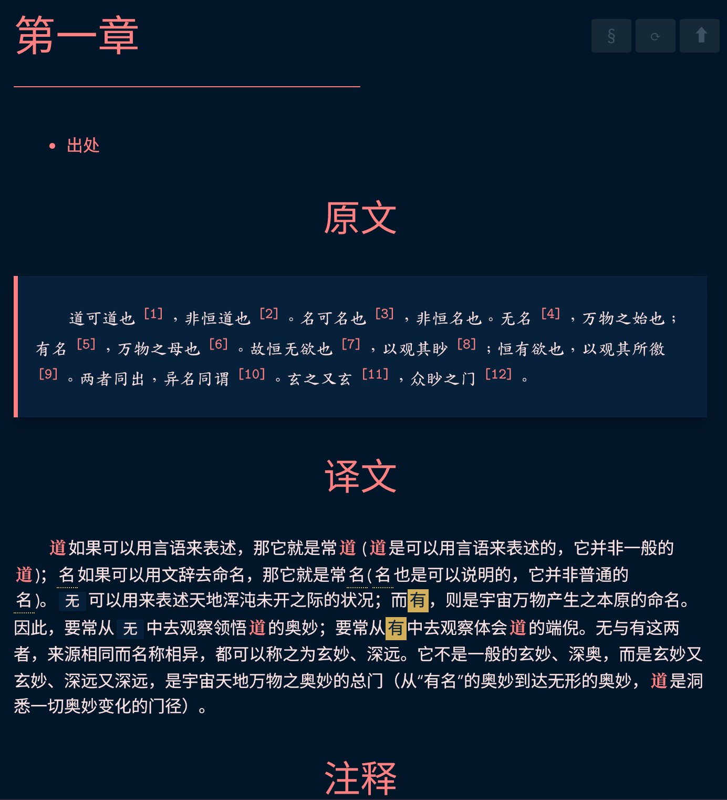
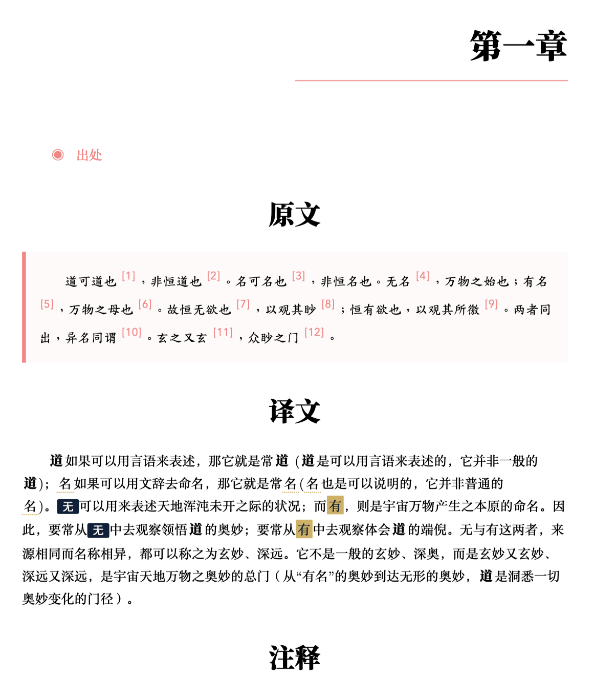
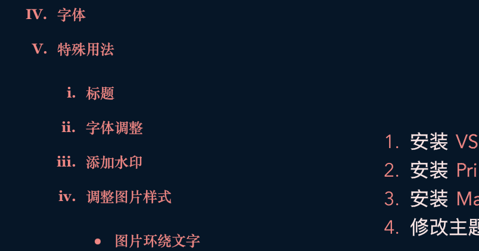
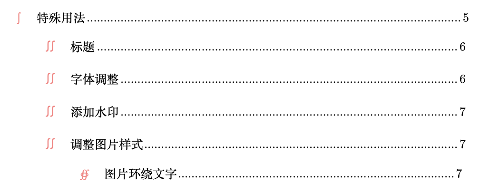
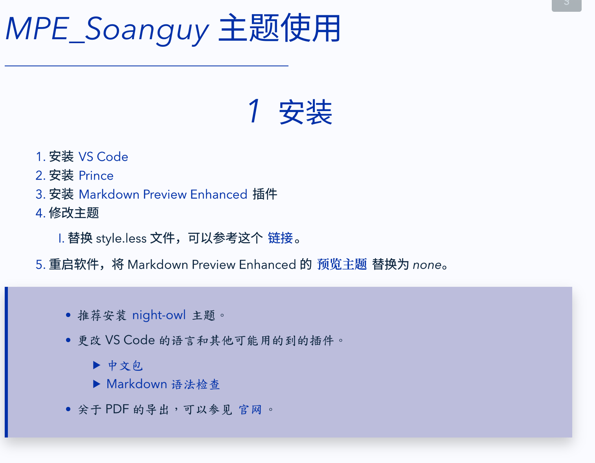
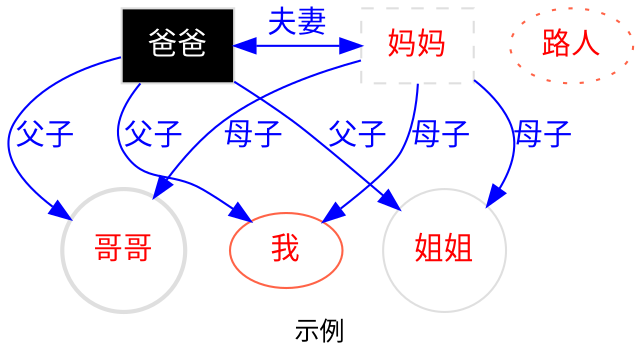

<div class="toc"><h2>table of contents</h2>
<!-- @import "[TOC]" {cmd="toc" depthFrom=2 depthTo=4 orderedList=false} -->

<!-- code_chunk_output -->

- [安装](#2)
- [预览](#3)
- [差异](#4)
- [更新](#5)
- [字体](#6)
- [特殊用法](#7)
  - [插入目录](#8)
  - [文档结构](#9)
  - [字体调整](#10)
  - [添加水印](#11)
  - [调整图片样式](#12)
    - [图片环绕文字](#13)
  - [页面调整](#14)
  - [mermaid](#15)
  - [其他说明](#16)
- [什么是 Markdown?](#18)
- [语法说明](#19)
  - [标题](#20)
  - [强调和行内代码](#21)
  - [列表和任务列表](#22)
  - [添加图片](#23)
  - [链接](#24)
  - [引用](#25)
  - [分割线](#26)
  - [代码块](#27)
    - [语法高亮](#28)
    - [代码块 class（MPE 扩展的特性）](#29)
  - [表格](#32)
    - [样式预览](#33)
- [扩展的语法](#34)
  - [表格](#35)
  - [Emoji、Font-Awesome](#36)
    - [样式预览](#37)
  - [脚注、缩略](#38)
  - [标记、上标、下标](#39)
    - [样式预览](#40)
  - [CriticMarkup](#41)
    - [样式预览](#42)
  - [Admonition](#43)
    - [样式预览](#44)
- [参考](#45)
- [测试分页](#46)

<!-- /code_chunk_output -->
</div>

# <i>MPE_Soanguy</i> 主题使用 {#1}

## 安装 {#2}

1. 安装 [VS Code][]
1. 安装 [Prince][]
1. 安装 [Markdown Preview Enhanced][] 插件
1. 修改主题
   1. 复制 style.less 文件和 assets 文件夹到 .mume 文件夹下。可以参考这个 [链接][]。
1. 重启软件，将 Markdown Preview Enhanced 的 **预览主题** 替换为 <i>none</i>。

> - 推荐安装 [night-owl][] 主题。
>
> - 更改 VS Code 的语言和其他可能用的到的插件。
>
>   - [中文包][]
>   - [Markdown 语法检查][]
>
> - 关于 PDF 的导出，可以参见 [官网][]。

## 预览 {#3}

<div class="col2">

  <details><summary>屏显预览</summary></details>

  <details><summary>打印预览</summary></details>

</div>

> ⚠️请注意：本主题并未针对导出为 图片 格式做任何优化。
>
> ⚠️请注意：本主题主要在 macOS 系统上进行的测试。在 Windows 系统上可能会有些许显示差异。具体差异见 [差异](#contrast)。

## 差异 {#4}

1. 为什么我安装主题后，看起来会有点模糊？

    Windows 系统的字体渲染和 macOS 系统的字体渲染有些许不同，在 macOS 上看起来很清晰的字体，可能在 Windows 上不会那么的清晰。如果能很清晰的看出有叠影，可以尝试注释掉下方的代码：

    ```css {.line-numbers}
    -webkit-font-smoothing: "auto";
    -webkit-text-stroke-width: calc(calc(40px - 1em) / 170);
    ```

1. 我是用的是 Linux 系统，这个主题会兼容吗？

    如果正在使用的是 Linux 系统，例如：Ubuntu、OpenSUSE 等。基本上不会有太多的显示问题。大体而言，所有系统唯一有区别的地方就在于字体。在 Deepin 20.5 上经过测试发现：导出为 PDF 时，因为系统缺失 **楷体、仿宋** 等字体而导致无法正常显示文字。解决办法也很简单，只要安装必要的字体即可。

1. 为什么我在 Edge、Chrome 等浏览器上可以正常显示楷体、仿宋等字体，但是在 Safari 上的显示情况却不尽人意呢？

    Safari 浏览器自某个版本之后，就禁止调用本地字体显示。如果要预览文件或者其他情形，请不要使用 Safari。

## 更新 {#5}

- 2022.05.02
  - 调整了**代码**的字体显示不正常的问题。将代码的中文字体更改为**楷体**。
  - 修复了不显示页眉页脚的问题 <span class="fn">⚠️注意：当您发现无法正常显示页眉页脚时，请查看`@page:left`和`@page:right`中间是否有**空格**。如果存在空格，请用文本编辑器将其清除后，再重新生成 pdf。</span>。
- 2022.05.03
  - 图片可以浮动于文字周围
  - 标题可以自动编号（二级到四级标题）
- 2022.05.04
  - 支持 <i>STIX MATH、emoji</i> 字体
- 2022.05.05
  - 支持目录页
  - 支持相互引用<span class="fn">关于相互引用的用法可以参见 [PrinceXML][]</span>
- 2023.02
  - 距离本月截止，更新了较多的内容，主要包括：目录、旁注、中文排版、图片缩放等。详细的使用方法可以参见下方的介绍。
- 2023.03 距离本月截止，再次更新的项目主要包括：
  - 支持 ruby 标签。现在您可以使用 `[汉字]^{注音}` 的语法来快速为某些文字做标注。这是一个示例： [汉字]^{hànzi}。虽然目前 princexml 并未完整支持还标签，但并不影响输出。
  - 支持大面积更换语言字体显示。现在您可以使用 `<div id="mainbody_jp"></div>` 这一标签来快速切换主要字体为日文字体。
  - 更新了试卷模式，并作了适当调整。页面现在可以容纳能多的内容。
  - 目前仍在尝试打印为更多的页面大小样式。

## 字体 {#6}

!!! warning 字体安装
    ⚠️ 上述字体不下载也可以正常显示，此时会调用系统的宋体和黑体来显示。其他的如：楷体、仿宋、隶书、圆体等都会显示为宋体或黑体。

默认使用了如下字体：

| 英文字体                   | 中文字体     | 日文字体                |
| -------------------------- | ------------ | ----------------------- |
| Avenir Next                | 思源黑体     | Kozuka Gothic Pr6N      |
| Latin Modern Roman         | 思源宋体     | Kozuka Mincho Pr6N      |
| Latin Modern Roman Dunhill | 江城圆体     | A-OTF Kyoukasho ICA Pro |
| Latin Modern Roman Slanted | TH-Khaai-PP0 | A-OTF Jomin Std         |
| Latin Modern Mono          | HYFangSongS  | A-OTF Likurei Std       |
|                            | FZLiBian-S02 |                         |

> 下面是各操作系统缺省情况下显示的字体：
>
> - 如果您使用的是 Windows 系统，可以不需要额外安装字体。此时，默认的字体分别为：中易宋体、黑体、楷体、仿宋；日文的默认字体为：YuMincho、YuGothic、YuKyokasho。如果正常显示 圆体、隶书体等，请下载专门的字体，并在 less 文件中声明。
> - 如果您使用的是 macOS 系统，可以不需要额外安装字体。此时默认的字体分别为：苹方字体、华文字体。日文字体的显示同 Windows。
> - 如果您使用的是 Ubuntu、Opensuse、ArchLinux 等常见的操作系统，也可以不需要额外安装字体。此时默认显示的多为：文鼎字体和 noto 字体。但部分操作系统可能并未预装中文写作环境所需要的楷体、仿宋等字体。请自行安装。

> 可以通过这个链接 [font][] 下载所需字体。大概有 290M。
>
> 阿里云盘目前并不不支持分享 ttf 格式的思源字体。但可以通过这个链接下载 (otc 格式，Windows 系统可能无法使用。也可自行搜索下载。)：[思源黑体][],[思源宋体][]。

## 特殊用法 {#7}

> [Markdown Preview Enhanced 插件使用说明][]

### 插入目录 {#8}

可以通过插件 [Markdown Preview Enhanced][] 或者 [Markdown TOC][] 来快速的插入目录。

如果想要将目录正常显示在打印页面中，可以将目录包裹在下列代码之中。

```html {.line-numbers}
<div class="toc">
<h2>table of contents</h2>

目录所在

</div>
```

- 目录的预览。主题目前设定的目录在网页（宽度大于 1200px）中和在打印中显示的样式是不同的。当宽度小于 1200px 时默认不对目录进行处理。

<div class="col2">

  <details><summary>屏显预览</summary></details>

  <details><summary>打印预览</summary></details>

</div>

<details><summary>其他样式</summary></details>

### 文档结构 {#9}

- 在不添加任何 HTML 元素的情况下，将默认为一篇文章。打印时，一级标题作为分页处，且除一级标题外，所有标题自动编号。
- 在使用 `<div class="documents">` 包裹所有文档的情况下，展示样式和不使用 HTML 元素相同。
- 在使用 `<div class="documents_chapter">` 包裹所有文档的情况下，一级标题将自动编号【形如：第一章等】。→更适合写长文档、书籍
- 在使用 `<div class="documents_chapter_old">` 包裹所有文档的情况下，一级标题将自动编号【形如：XX 第一等】。→更适合写古籍文档、书籍
- 在使用 `<div class="documents_chapter_old_none">` 包裹所有文档的情况下，一级标题将自动编号【形如：XX 第一等】，其余标题将不会再编号。→更适合写古籍文档、书籍
- 在使用 `<div class="documents_volume">` 包裹所有文档的情况下，一级标题将自动编号【形如：第一章等】，另外可以使用`<div class="volume">`来生成多个卷【形如：第一卷】。→更适合写长文档、书籍
- 在使用 `<div class="documents_volume_old">` 包裹所有文档的情况下，一级标题将自动编号【形如：第一章等】，另外可以使用`<div class="volume">`来生成多个卷【形如：卷之一】。→更适合写长文档、书籍

### 字体调整 {#10}

使用部分 html 标签可以达到特殊效果。如：修改字体、颜色等。具体见 [其他说明](#others)<span class="fn"><a class="pageref" href="#others"></a></span>

> 当然，也可以使用 Latex 语法来更改字体样式。例如：
>
> - $\color{blue}{RED}$
> - $\huge{SMALL}$
> - $\small\color{red}{HUGE}$

!!! question <span style="font-family:var(--font-kai-cn)">我想要使用斜体，可是我使用了`_ _`和`* *`之后，却发现字体并没有发生太大的变化，这是为什么？</span>
    在这个主题里面，默认下的`_ _`和`* *`会将字体从**中文**字体变换为**日文**字体。例如：

    - 这是默认下的日文字体：あいうえお。
    - 这是强调下的日文字体：_あいうえお_。
    
    那么，我该如何使用斜体呢？
    
    可以通过为文字添加`<i></i>`标签来让文字倾斜。例如：
    
    - 这是默认下的中文字体：这是没有添加 i 标签的中文。
    - 这是斜体下的中文字体：<i>这是添加了 i 标签的中文</i>。

### 添加水印 {#11}

找到 style.less 文件，修改下方的`商无辛`为自己想要的水印即可。`color`、`font-size`等也可以按照需要修改。

```css{.line-numbers}
@prince-overlay {
    color: rgba(0, 0, 0, 0.015);
    content: "商无辛";
    font-size: 10pt;
    font-family: var(--font-hei-cn);
    vertical-align: top;
}
```

### 调整图片样式 {#12}

- 
- 
- 
- 

#### 图片环绕文字 {#13}

如果想要让图片浮动于文字的左右侧，可以添加`left`或者`right`来实现。请注意，在使用浮动时，请同时调整图片大小。另外，也可以通过主动添加多个换行`<br />`来实现某些效果。例如：


这是一段测试文字。道可道也 [^①]，非恒道也 [^②]。名可名也 [^③]，非恒名也。无名 [^④]，万物之始也；有名 [^⑤]，万物之母也 [^⑥]。故恒无欲也 [^⑦]，以观其眇 [^⑧]；恒有欲也，以观其所徼 [^⑨]。两者同出，异名同谓 [^⑩]。玄之又玄 [^⑾]，众眇之门 [^⑿]。<br /><br />


这是一段测试文字。道可道也 [^①]，非恒道也 [^②]。名可名也 [^③]，非恒名也。无名 [^④]，万物之始也；有名 [^⑤]，万物之母也 [^⑥]。故恒无欲也 [^⑦]，以观其眇 [^⑧]；恒有欲也，以观其所徼 [^⑨]。两者同出，异名同谓 [^⑩]。玄之又玄 [^⑾]，众眇之门 [^⑿]。

### 页面调整 {#14}

1. 调整页面大小。找到这行代码，按照需要修改即可。

    ```css{.line-numbers}
    //通过 size 来控制打印大小，可选值为任意的尺寸组合或者固定的页面尺寸。例如，size:8in 11in(width*height);size:a4 landscape;size:a4 portrait
    ```

1. 调整页眉页脚。修改第 1139 行到 1193 行的代码即可。（以`@page:right`和`@page:left`开头）
1. 调整脚注。找到`.fn {`并修改其中的代码即可。
1. 为适合打印输出，默认设置所有的一级标题前都会有换页符，即在新的一页上重新开始，且全部居于**左侧**。如果不需要的话，可以删去 `h1`下的这段代码：`break-before: right`。

### mermaid {#15}

Markdown Preview Enhanced 无法将 mermaid 导出为 PDF。作为替代，可以使用 dotted 来制图。

> 请忽视图片的配色，只为演示。



### 其他说明 {#16}

1. 如何添加脚注：使用 `<span class="fn"></span>` 包裹脚注内容即可。
1. 如何快速分页：使用 `<hr class="break_after">`。
1. 如何大面积使用楷体：`<div class="intro"></div>`。
1. 如何 90 度旋转页面：`<div class="vertical_contents">`。
1. 添加标签：<kbd>kbd 标签 臣本布衣</kbd>
1. 修改字体：
   1. 中文<tt>tt 标签 臣本布衣あいうえお</tt>
   1. 日文<em><tt>tt 标签 臣本布衣あいうえお</tt></em>
   1. 中文<samp>samp 标签 臣本布衣</samp>
   1. 日文<em><samp>samp 标签 臣本布衣</samp></em>
   1. <ruby>ruby 标签 臣本布衣<ruby>
1. 其他的具有语义的标签：

    - <ins>ins 臣本布衣，用于公式</ins>
    - <var>var 臣本布衣，用于警示</var>
    - <dfn>dfn 臣本布衣，用于例题</dfn>

[VS Code]:https://code.visualstudio.com/Download
[Prince]:https://www.princexml.com/download/
[Markdown Preview Enhanced]:https://marketplace.visualstudio.com/items?itemName=shd101wyy.markdown-preview-enhanced
[链接]:https://shd101wyy.github.io/markdown-preview-enhanced/#/zh-cn/customize-css
[night-owl]:https://marketplace.visualstudio.com/items?itemName=sdras.night-owl
[中文包]:https://marketplace.visualstudio.com/items?itemName=MS-CEINTL.vscode-language-pack-zh-hans
[Markdown 语法检查]:https://marketplace.visualstudio.com/items?itemName=DavidAnson.vscode-markdownlint
[官网]:https://shd101wyy.github.io/markdown-preview-enhanced/#/zh-cn/
[font]:https://www.aliyundrive.com/s/YZ7YJkxGgmk
[思源黑体]:https://mirrors.tuna.tsinghua.edu.cn/adobe-fonts/source-han-sans/OTC/
[思源宋体]:https://mirrors.tuna.tsinghua.edu.cn/adobe-fonts/source-han-serif/OTC/
[PrinceXML]:https://www.princexml.com/doc/gen-content/#using-target-counter
[Markdown TOC]:https://marketplace.visualstudio.com/items?itemName=joffreykern.markdown-toc
[Markdown Preview Enhanced 插件使用说明]:https://shd101wyy.github.io/markdown-preview-enhanced/#/zh-cn/

# 样式预览 {#17}

以下内容来源自 [MPE 官方](https://shd101wyy.github.io/markdown-preview-enhanced/#/zh-cn/markdown-basics)

## 什么是 Markdown? {#18}

`Markdown` 是一种文本格式。你可以用它来控制文档的显示。使用 markdown，你可以创建粗体的文字，斜体的文字，添加图片，并且创建列表 等等。基本上来讲，Markdown 就是普通的文字加上 `#` 或者 `*` 等符号。

## 语法说明 {#19}

### 标题 {#20}

```markdown
# 这是 <h1> 一级标题

## 这是 <h2> 二级标题

### 这是 <h3> 三级标题

#### 这是 <h4> 四级标题

##### 这是 <h5> 五级标题

###### 这是 <h6> 六级标题
```

如果你想要给你的标题添加 `id` 或者 `class`，请在标题最后添加 `{#id .class1 .class2}`。例如：

```markdown
# 这个标题拥有 1 个 id {#my_id}

# 这个标题有 2 个 classes {.class1 .class2}
```

> 这是一个 MPE 扩展的特性。

### 强调和行内代码 {#21}

```markdown
*这会是 斜体 的文字*
_这会是 斜体 的文字_

**这会是 粗体 的文字**
__这会是 粗体 的文字__

_你也 **组合** 这些符号_

~~这个文字将会被横线删除~~

`这是一串行内代码 <inline_code>`
```

### 列表和任务列表 {#22}

```markdown
- Item 1
- Item 2
  - Item 2a
  - Item 2b
```

```markdown
1. Item 1
1. Item 2
1. Item 3
   1. Item 3a
   1. Item 3b
```

```markdown
- [x] @mentions, #refs, [links](), **formatting**, and <del>tags</del> supported
- [x] list syntax required (any unordered or ordered list supported)
- [x] this is a complete item
- [ ] this is an incomplete item
```

- Item 1
- Item 2
  - Item 2a
  - Item 2b

1. Item 1
1. Item 2
1. Item 3
   1. Item 3a
   1. Item 3b

- [x] @mentions, #refs, [links](), **formatting**, and <del>tags</del> supported
- [x] list syntax required (any unordered or ordered list supported)
- [x] this is a complete item
- [ ] this is an incomplete item

### [添加图片](https://shd101wyy.github.io/markdown-preview-enhanced/#/zh-cn/markdown-basics?id=添加图片) {#23}

```markdown

Format: 
```

### 链接 {#24}

```markdown
https://github.com - 自动生成！
[GitHub](https://github.com)
```

- <https://github.com> - 自动生成！
- [GitHub](https://github.com)

### 引用 {#25}

```markdown
正如 Kanye West 所说：

> We're living the future so
> the present is our past.
```

正如 Kanye West 所说：

> We're living the future so
> the present is our past.

### 分割线 {#26}

```markdown
如下，三个或者更多的

---

连字符

---

星号

---

下划线
```

### 代码块 {#27}

你可以在你的代码上面和下面添加 ````` 来表示代码块。

#### 语法高亮 {#28}

你可以给你的代码块添加任何一种语言的语法高亮。例如，给 ruby 代码添加语法高亮：

~~~markup
```ruby
require 'redcarpet'
markdown = Redcarpet.new("Hello World!")
puts markdown.to_html
```
~~~

会得到下面的效果：

```ruby
require 'redcarpet'
markdown = Redcarpet.new("Hello World!")
puts markdown.to_html
```

#### 代码块 class（MPE 扩展的特性） {#29}

你可以给你的代码块设置 `class`。例如，添加 `class1 class2` 到一个代码块：

~~~markup
```javascript {.class1 .class}
function add(x, y) {
  return x + y
}
```
~~~

##### 代码行数 {#30}

如果你想要你的代码块显示代码行数，只要添加 `line-numbers` class 就可以了。例如：

```javascript {.line-numbers}
function add(x, y) {
  return x + y
}
```

##### 高亮代码行数 {#31}

你可以通过添加 `highlight` 属性的方式来高亮代码行数：

~~~markdown
```javascript {highlight=10}
```

```javascript {highlight=10-20}
```

```javascript {highlight=[1-10,15,20-22]}
```
~~~

### 表格 {#32}

```markdown
| First Header                | Second Header                |
| --------------------------- | ---------------------------- |
| Content from cell 1         | Content from cell 2          |
| Content in the first column | Content in the second column |
```

#### 样式预览 {#33}

| First Header                | Second Header                |
| --------------------------- | ---------------------------- |
| Content from cell 1         | Content from cell 2          |
| Content in the first column | Content in the second column |

| 左对齐   |   右对齐 | 居中对齐 |
| :------- | -------: | :------: |
| 单元格   |   单元格 |  单元格  |
| 单元格 1 | 单元格 2 | 单元格 3 |

## 扩展的语法 {#34}

### 表格 {#35}

> 需要在插件设置中打开 `enableExtendedTableSyntax` 选项来使其工作。

### Emoji、Font-Awesome {#36}

> 只适用于 `markdown-it parser` 而不适用于 `pandoc parser`。
> 缺省下是启用的。你可以在插件设置里禁用此功能。

```markdown
:smile:
:fa-car:
```

#### 样式预览 {#37}

:smile:，:fa-car:

### 脚注、缩略 {#38}

```markdown
Content [^1]

[^1]: Hi! This is a footnote

*[HTML]: Hyper Text Markup Language
*[W3C]: World Wide Web Consortium
The HTML specification
is maintained by the W3C.
```

Content [^1]

[^1]: Hi! This is a footnote

*[HTML]: Hyper Text Markup Language
*[W3C]: World Wide Web Consortium

The HTML specification is maintained by the W3C.

### 标记、上标、下标 {#39}

```markdown
==marked==

30^th^

H~2~O
```

#### 样式预览 {#40}

==marked==

30^th^

H~2~O

### CriticMarkup {#41}

CriticMarkup 缺省是禁用的，你可以通过插件设置来启动它。
有关 CriticMarkup 的更多信息，请查看 [CriticMarkup 用户指南](https://criticmarkup.com/users-guide.php).

这里有 5 种基本语法：

- 添加 `{++ ++}`
- 删除 `{-- --}`
- 替换 `{~~ ~> ~~}`
- 注释 `{>> <<}`
- 高亮 `{== ==}{>> <<}`

> CriticMarkup 仅可用于 markdown-it parser，不与 pandoc parser 兼容。

#### 样式预览 {#42}

注意：注意已经修改了原本的 CriticMarkup 所生成样式。如果需要原本 CriticMarkup 的功能需要禁用主题内的 `ins`、`del` 等元素的相关代码。

{++CriticMarkup++} {>>仅可用于<<} {~~markdownit parser ~> markdown-it parser~~}，不与 {--pandoc parser--} 兼容。

### Admonition {#43}

```admonition
!!! note This is the admonition title
    This is the admonition body
```

> 请在 <https://squidfunk.github.io/mkdocs-material/reference/admonitions/> 查看更多信息

#### 样式预览 {#44}

!!! info
    测试内容

!!! warning ""
    没有标题的测试内容

!!! warning 标题测试
    有标题的测试内内容

## 参考 {#45}

- [Mastering Markdown](https://guides.github.com/features/mastering-markdown/)
- [Daring Fireball: Markdown Basics](https://daringfireball.net/projects/markdown/basics)

<details><summary>Title of Contents</summary>contents contents contents contents</details>

<hr class="break_after">

## 测试分页 {#46}

<div class="sidenote">

# 其他样式测试 {#47}

1. <span class="border">为文字创建一个方框</span>

    <div class="border">为文字创建一个方框，默认文字居中。</div><note>边框创建<code>.border</code></note>

1. 为段落分为两列。<note>分列<code>.col2</code></note>

    <div class="col2">

    这是第一列，文章内容如下。

    **道**如果可以用言语来表述，那它就是常**道** (**道**是可以用言语来表述的，它并非一般的**道**)；<u>名</u>如果可以用文辞去命名，那它就是常<u>名</u>(<u>名</u>也是可以说明的，它并非普通的<u>名</u>)。`无`可以用来表述天地浑沌未开之际的状况；而==有==，则是宇宙万物产生之本原的命名。因此，要常从`无`中去观察领悟**道**的奥妙；要常从==有==中去观察体会**道**的端倪。无与有这两者，来源相同而名称相异，都可以称之为玄妙、深远。它不是一般的玄妙、深奥，而是玄妙又玄妙、深远又深远，是宇宙天地万物之奥妙的总门（从“有名”的奥妙到达无形的奥妙，**道**是洞悉一切奥妙变化的门径）。

    这是第二列，文章内容如下。

    **道**如果可以用言语来表述，那它就是常**道** (**道**是可以用言语来表述的，它并非一般的**道**)；<u>名</u>如果可以用文辞去命名，那它就是常<u>名</u>(<u>名</u>也是可以说明的，它并非普通的<u>名</u>)。`无`可以用来表述天地浑沌未开之际的状况；而==有==，则是宇宙万物产生之本原的命名。因此，要常从`无`中去观察领悟**道**的奥妙；要常从==有==中去观察体会**道**的端倪。无与有这两者，来源相同而名称相异，都可以称之为玄妙、深远。它不是一般的玄妙、深奥，而是玄妙又玄妙、深远又深远，是宇宙天地万物之奥妙的总门（从“有名”的奥妙到达无形的奥妙，**道**是洞悉一切奥妙变化的门径）。

    </div>

1. 字体更改<note>字体更改<code>.cn/.jp/.song/.hei/.kai</code></note>

    <ul><li><div class="cn song">

     **道**如果可以用言语来表述，那它就是常**道** (**道**是可以用言语来表述的，它并非一般的**道**)；<u>名</u>如果可以用文辞去命名，那它就是常<u>名</u>(<u>名</u>也是可以说明的，它并非普通的<u>名</u>)。`无`可以用来表述天地浑沌未开之际的状况；而==有==，则是宇宙万物产生之本原的命名。因此，要常从`无`中去观察领悟**道**的奥妙；要常从==有==中去观察体会**道**的端倪。无与有这两者，来源相同而名称相异，都可以称之为玄妙、深远。它不是一般的玄妙、深奥，而是玄妙又玄妙、深远又深远，是宇宙天地万物之奥妙的总门（从“有名”的奥妙到达无形的奥妙，**道**是洞悉一切奥妙变化的门径）。 </div></li>

     <li><div class="cn hei">

     **道**如果可以用言语来表述，那它就是常**道** (**道**是可以用言语来表述的，它并非一般的**道**)；<u>名</u>如果可以用文辞去命名，那它就是常<u>名</u>(<u>名</u>也是可以说明的，它并非普通的<u>名</u>)。`无`可以用来表述天地浑沌未开之际的状况；而==有==，则是宇宙万物产生之本原的命名。因此，要常从`无`中去观察领悟**道**的奥妙；要常从==有==中去观察体会**道**的端倪。无与有这两者，来源相同而名称相异，都可以称之为玄妙、深远。它不是一般的玄妙、深奥，而是玄妙又玄妙、深远又深远，是宇宙天地万物之奥妙的总门（从“有名”的奥妙到达无形的奥妙，**道**是洞悉一切奥妙变化的门径）。 </div></li>

    <li><div class="cn kai">

     **道**如果可以用言語來表述，那它就是常**道** (**道**是可以用言語來表述的，它並非一般的**道**)；<u>名</u>如果可以用文辭去命名，那它就是常<u>名</u>(<u>名</u>也是可以說明的，它並非普通的<u>名</u>)。`無`可以用來表述天地渾沌未開之際的狀況；而==有==，則是宇宙萬物產生之本原的命名。因此，要常從`無`中去觀察領悟**道**的奧妙；要常從==有==中去觀察體會**道**的端倪。無與有這兩者，來源相同而名稱相異，都可以稱之為玄妙、深遠。它不是一般的玄妙、深奧，而是玄妙又玄妙、深遠又深遠，是宇宙天地萬物之奧妙的總門（從「有名」的奧妙到達無形的奧妙，**道**是洞悉一切奧妙變化的門徑）。 </div></li>

     <li><div class="jp song">

     **道**如果可以用言语来表述，那它就是常**道** (**道**是可以用言语来表述的，它并非一般的**道**)；<u>名</u>如果可以用文辞去命名，那它就是常<u>名</u>(<u>名</u>也是可以说明的，它并非普通的<u>名</u>)。`无`可以用来表述天地浑沌未开之际的状况；而==有==，则是宇宙万物产生之本原的命名。因此，要常从`无`中去观察领悟**道**的奥妙；要常从==有==中去观察体会**道**的端倪。无与有这两者，来源相同而名称相异，都可以称之为玄妙、深远。它不是一般的玄妙、深奥，而是玄妙又玄妙、深远又深远，是宇宙天地万物之奥妙的总门（从“有名”的奥妙到达无形的奥妙，**道**是洞悉一切奥妙变化的门径）。 </div></li>

     <li><div class="jp hei">

     **道**如果可以用言语来表述，那它就是常**道** (**道**是可以用言语来表述的，它并非一般的**道**)；<u>名</u>如果可以用文辞去命名，那它就是常<u>名</u>(<u>名</u>也是可以说明的，它并非普通的<u>名</u>)。`无`可以用来表述天地浑沌未开之际的状况；而==有==，则是宇宙万物产生之本原的命名。因此，要常从`无`中去观察领悟**道**的奥妙；要常从==有==中去观察体会**道**的端倪。无与有这两者，来源相同而名称相异，都可以称之为玄妙、深远。它不是一般的玄妙、深奥，而是玄妙又玄妙、深远又深远，是宇宙天地万物之奥妙的总门（从“有名”的奥妙到达无形的奥妙，**道**是洞悉一切奥妙变化的门径）。 </div></li>

    <li><div class="jp kai">

     **道**如果可以用言語來表述，那它就是常**道** (**道**是可以用言語來表述的，它並非一般的**道**)；<u>名</u>如果可以用文辭去命名，那它就是常<u>名</u>(<u>名</u>也是可以說明的，它並非普通的<u>名</u>)。`無`可以用來表述天地渾沌未開之際的狀況；而==有==，則是宇宙萬物產生之本原的命名。因此，要常從`無`中去觀察領悟**道**的奧妙；要常從==有==中去觀察體會**道**的端倪。無與有這兩者，來源相同而名稱相異，都可以稱之為玄妙、深遠。它不是一般的玄妙、深奧，而是玄妙又玄妙、深遠又深遠，是宇宙天地萬物之奧妙的總門（從「有名」的奧妙到達無形的奧妙，**道**是洞悉一切奧妙變化的門徑）。 </div></li>

1. 习题编号。默认为日文。<note>选择习题<code>.choices→.choices_part/.c4/.c2</code></note>

    <div class="choices"><div class="choices_part c4">

    1. 题干
       - 选项 A
       - 选项 B
       - 选项 C
       - 选项 D

    <div class="c2">

    2. 题干
       - 选项 A
       - 选项 B
       - 选项 C
       - 选项 D

    </div></div></div>

    <div class="choices cn song"><div class="choices_part c4">

    1. 题干
       - 选项 A
       - 选项 B
       - 选项 C
       - 选项 D

    <div class="c2">

    2. 题干
       - 选项 A
       - 选项 B
       - 选项 C
       - 选项 D

    </div></div></div>

1. 和表格样式相关<note>表格样式<code>.nopadding/.nopad/.noborder/.sfont/.lbtable</code></note>

<div class="nopadding">

| 左对齐   |   右对齐 | 居中对齐 |
| :------- | -------: | :------: |
| 单元格   |   单元格 |  单元格  |
| 单元格 1 | 单元格 2 | 单元格 3 |

</div>
<div class="noborder">

| 左对齐   |   右对齐 | 居中对齐 |
| :------- | -------: | :------: |
| 单元格   |   单元格 |  单元格  |
| 单元格 1 | 单元格 2 | 单元格 3 |

</div>
<div class="sfont">

| 左对齐   |   右对齐 | 居中对齐 |
| :------- | -------: | :------: |
| 单元格   |   单元格 |  单元格  |
| 单元格 1 | 单元格 2 | 单元格 3 |

</div>
<div class="lbtable">

| 左对齐   |   右对齐 | 居中对齐 |
| :------- | -------: | :------: |
| 单元格   |   单元格 |  单元格  |
| 单元格 1 | 单元格 2 | 单元格 3 |

</div></div>

<div class="vertical_contents">

## 旋转九十度 {#48}

| 左对齐   |   右对齐 | 居中对齐 |
| :------- | -------: | :------: |
| 单元格   |   单元格 |  单元格  |
| 单元格 1 | 单元格 2 | 单元格 3 |

</div>